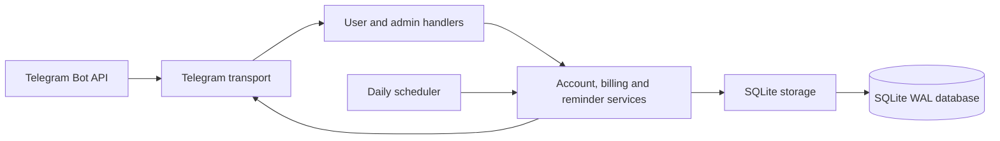

# VPN Balance Bot

[](https://github.com/Nergous/vpn-balance-bot/actions/workflows/ci.yml)
[](go.mod)
[](LICENSE)

Self-hosted Telegram bot for tracking VPN subscription balances, payments,
monthly charges, invitations, and debt reminders.

The project targets a small service with one administrator, pre-created customer
profiles, one application process, and one SQLite database.

## Features

- Customer balance, payment history, next charge date, and prepaid-period view.
- Single-use invite tokens that bind a Telegram account to a customer profile.
- Administrative user management, payments, adjustments, reversals, and reminders.
- Automatic monthly charges and scheduled debt reminders.
- Immutable integer-minor-unit financial ledger.
- Durable Telegram update deduplication and reminder delivery tracking.
- Russian interface by default, with English localization available.
- Embedded, checksummed SQLite migrations and verified online backups.
- Hardened systemd service for single-host Linux deployments.

## Quick start

Requirements: Docker with Compose, or the Go version declared in
[`go.mod`](go.mod), plus a bot token from BotFather and the numeric Telegram ID
of the administrator.

```bash
git clone https://github.com/Nergous/vpn-balance-bot.git
cd vpn-balance-bot
cp .env.example .env
```

Set at least these values in `.env`:

```dotenv
TELEGRAM_BOT_TOKEN=replace-with-botfather-token
ADMIN_TELEGRAM_ID=123456789
DATABASE_PATH=./data/vpn-balance-bot.db
```

### Docker Compose

```bash
docker compose up -d --build
docker compose logs -f bot
```

Compose forces `APP_ENV=production`, stores SQLite in the
`vpn-balance-data` named volume, uses a read-only root filesystem, drops Linux
capabilities, and publishes no network ports.

Stop the service without deleting its database volume:

```bash
docker compose down
```

### Local Go process

Start without Docker:

```bash
go run ./cmd/vpn-balance-bot
```

The application creates the database directory, opens SQLite in WAL mode,
applies embedded migrations, validates the Telegram token, and starts long
polling. Stop it with `Ctrl+C`.

Run `make help` for the common development and container commands.

## Telegram commands

Customers:

```text
/start [invite-token]  Link a profile or show available commands
/status                Show balance, fee, and next charge date
/history               Show recent ledger entries
/help                  Show customer commands
```

Administrator:

```text
/admin                                      Dashboard
/admin users [status|all] [after-id]        List users
/admin invite <user-id>                     Create invite
/admin payment <user-id> <minor> [note]     Prepare payment
/admin confirm                              Confirm prepared payment
/admin cancel                               Cancel prepared payment
/admin remind <user-id> <text>              Send manual reminder
/admin reconcile <id> <date> <type> [key]   Reopen confirmed-unsent delivery
```

Additional lifecycle and ledger commands are available through `/admin help`.
All monetary command values use integer minor units; for RUB, `10000` means
`100.00 RUB`.

## Architecture



State-changing Telegram updates run inside a database transaction. Informational
Telegram responses are flushed only after commit, so a failed send cannot roll
back or duplicate a financial operation.

See [architecture](docs/architecture.md) and [database design](docs/database.md)
for boundaries, invariants, delivery states, and migration rules.

## Configuration

Development loads `.env`. Production must supply process environment variables;
the application refuses to load a local `.env` when `APP_ENV=production`.

| Variable | Required | Default | Contract |
|---|---:|---|---|
| `APP_ENV` | no | `development` | `development`, `test`, or `production` |
| `TELEGRAM_BOT_TOKEN` | yes | none | Token from BotFather; non-test startup verifies it with `getMe` |
| `ADMIN_TELEGRAM_ID` | yes | none | Positive numeric Telegram user ID |
| `DATABASE_PATH` | yes | none | SQLite path; production rejects memory, temp, and test-like paths |
| `APP_TIMEZONE` | no | `Europe/Moscow` | Valid IANA timezone |
| `REMINDER_HOUR` | no | `9` | Local hour from `0` through `23` |
| `INVITE_TTL` | no | `168h` | Go duration of at least one second |
| `LOG_LEVEL` | no | `INFO` | `DEBUG`, `INFO`, `WARN`, or `ERROR` |
| `BOT_LANG` | no | `ru` | `ru` or `en` |
| `HTTP_TIMEOUT` | no | `30s` | Outbound HTTP timeout of at least `2s` |
| `DB_TIMEOUT` | no | `30s` | Positive SQLite operation timeout |

The complete annotated template is [`.env.example`](.env.example).

## Data safety

- Money is stored as signed `int64` minor units, never floating point.
- Ledger entries are immutable; corrections create reversal entries.
- Raw invite tokens are never persisted, only their hashes.
- Database writes use one serialized SQLite connection with foreign keys and WAL.
- Applied migrations are checked against embedded SHA-256 checksums.
- Backups run SQLite integrity and foreign-key checks before publication.
- Ambiguous Telegram deliveries are not blindly retried.
- Logs contain error classes and correlation identifiers, not tokens or message text.

Create a verified backup without Telegram credentials:

```bash
APP_ENV=production \
DATABASE_PATH=/var/lib/vpn-balance-bot/vpn-balance-bot.db \
./vpn-balance-bot backup /var/backups/vpn-balance-bot/backup.db
```

Never copy only the live `.db` file while SQLite WAL is active.

## Development

```bash
go test ./...
go test -race ./...
go vet ./...
go mod tidy -diff
gofmt -l .
go build ./cmd/vpn-balance-bot
```

Tests use temporary SQLite databases and fake or local Telegram transports. They
must not read production `.env`, open a live database, or contact the real
Telegram API.

## Deployment and operations

- [Production operations](docs/operations.md)
- [Backup and restore](docs/backup-and-restore.md)
- [Troubleshooting](docs/troubleshooting.md)
- [systemd service](deploy/vpn-balance-bot.service)
- [Docker Compose](compose.yml)
- [Architecture](docs/architecture.md)
- [Database design](docs/database.md)

A real-credential acceptance run must use a dedicated test bot and isolated test
database before any production token or production data is introduced.

## Repository structure

```text
cmd/vpn-balance-bot/       application entry point and maintenance commands
internal/app/              composition and lifecycle
internal/config/           environment loading and validation
internal/domain/           business types and rules
internal/localization/     embedded Russian and English catalogs
internal/service/          account, billing, reminder, and scheduler use cases
internal/storage/sqlite/   SQLite implementation and backup logic
internal/telegram/         Telegram adapter and handlers
internal/testutil/         isolated test fakes and helpers
migrations/                embedded additive SQL migrations
deploy/                    service-manager templates
docs/                      architecture and operations documentation
Dockerfile                 minimal non-root runtime image
compose.yml                single-service SQLite deployment
Makefile                   development and container commands
```

## Status

Core bot behavior, persistence, migrations, backups, tests, and systemd deployment
are implemented. Local container packaging is also available. Automated release
artifacts, repository community files, and an isolated host-level acceptance
drill remain before the first stable release.

## License

Released under the [MIT License](LICENSE).
