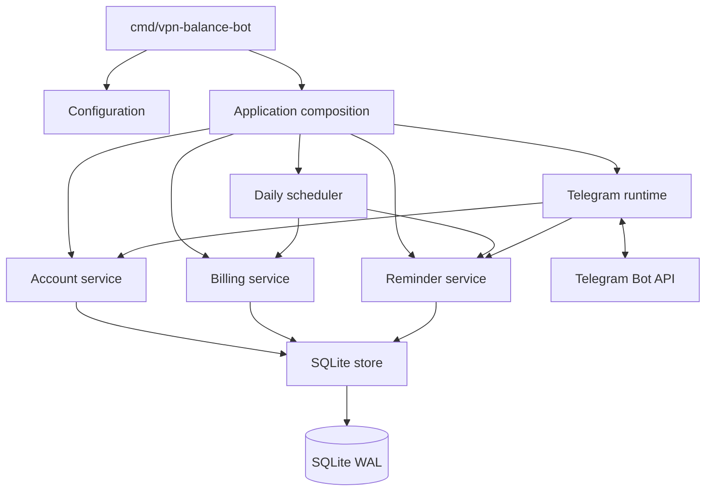
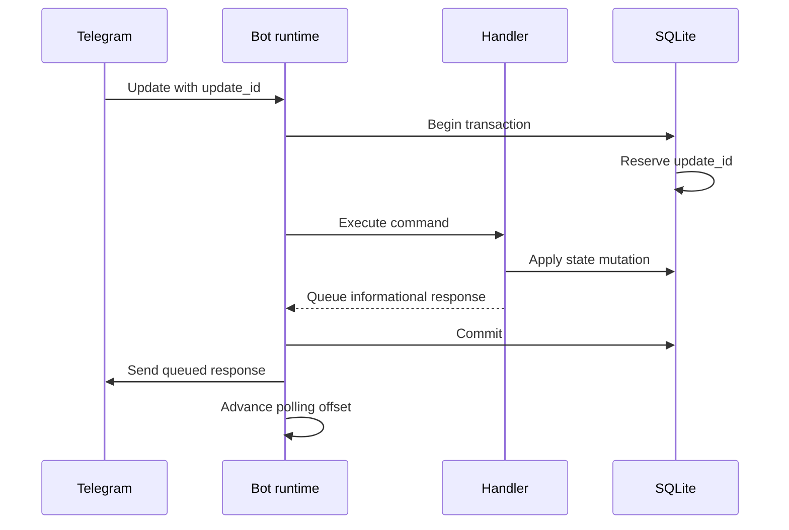

# Architecture

VPN Balance Bot is a single-process Go service with Telegram long polling, a
daily scheduler, and one SQLite database. The design favors explicit transaction
boundaries and operational simplicity over distributed execution.

## Runtime components

### `cmd/vpn-balance-bot`

Owns process signals, configuration loading, logging, application startup, and
maintenance subcommands. It contains no business rules.

### `internal/app`

Creates the database, applies migrations, composes services, starts Telegram
polling and the scheduler, and coordinates graceful shutdown.

### `internal/domain`

Defines money, users, ledger entries, billing dates, and reminder types. Domain
code does not depend on Telegram or SQLite.

### `internal/service`

Implements account, billing, reminder, and scheduling use cases against narrow
storage and sender interfaces.

### `internal/storage/sqlite`

Implements persistence, transactions, migrations, idempotency, reminder leases,
and verified backup. The connection pool is restricted to one connection so all
writes remain serialized.

### `internal/telegram`

Owns long polling, authorization, command parsing, localized presentation, and
Telegram transport behavior. Only the configured numeric administrator ID may
perform administrative actions. Customer actions require the bound private chat.

## Telegram update flow

Duplicate state-changing updates are ignored by the durable `update_id`
reservation. Telegram sends happen after commit. If a post-commit informational
response fails, the business mutation remains committed and is not repeated.

Manual reminder delivery follows its own durable reservation and delivery key
because the external send itself is the primary business action.

## Scheduler flow

The scheduler runs once per configured local calendar day:

1. Apply due monthly charges using unique billing-period ledger keys.
2. Select due reminders and previously scheduled retryable deliveries.
3. Reserve each attempt with a lease.
4. Send through Telegram.
5. Mark the exact attempt as sent, failed, skipped, or ambiguous.

Attempt fencing prevents a stale worker from completing a newer reservation.
Startup classifies deliveries left pending by an interrupted previous process as
`delivery_state_unknown`; it does not blindly resend them.

## Failure boundaries

- Configuration errors stop startup before runtime composition.
- Unknown or checksum-mismatched migrations stop startup.
- Financial writes and update idempotency commit atomically.
- Telegram transport failures use stable error classes, not raw API messages.
- Graceful shutdown waits for the polling and scheduler workers.
- The deployment model permits only one application process writing the database.

## Intentional constraints

- One administrator.
- One process.
- One SQLite database.
- Long polling rather than webhooks.
- No public HTTP API.
- No distributed scheduler or worker queue.

These constraints are part of the product boundary, not missing infrastructure.
They keep backup, deployment, and incident recovery understandable for the target
single-host installation.
