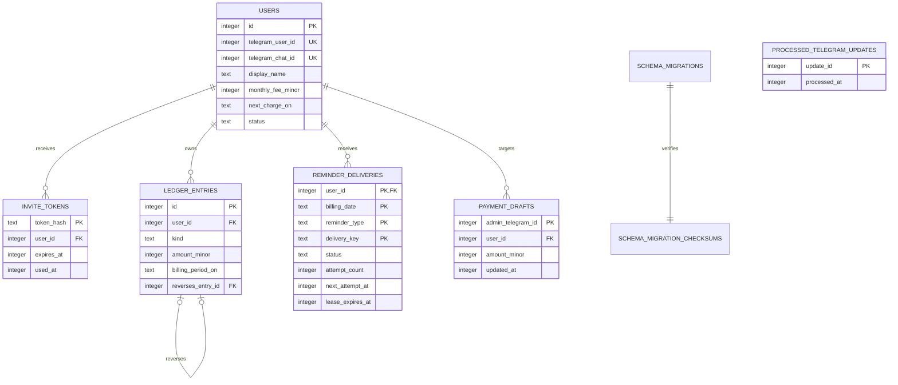

# Database design

VPN Balance Bot uses SQLite through `database/sql` and `modernc.org/sqlite`.
Foreign keys and WAL mode are enabled in the connection string, and the pool is
limited to one connection for serialized access.

## Entity relationships

## Tables

### `users`

Stores the billing profile and optional Telegram binding. Telegram IDs remain
nullable until a single-use invite is consumed. `billing_anchor_day` retains the
requested monthly day while `next_charge_on` stores the next actual local date.

Supported states are `active`, `paused`, and `disabled`.

### `invite_tokens`

Stores only a token hash. The raw token is returned once to the administrator and
never persisted. Tokens expire and can be consumed only once.

### `ledger_entries`

Immutable source of truth for balances. Entry kinds are:

- `opening_balance`
- `payment`
- `subscription_charge`
- `adjustment`
- `reversal`

Amounts are signed integer minor units. A unique partial index prevents duplicate
subscription charges for the same user and billing period. A reversal references
one original entry, and reversal-of-reversal is rejected by service and storage
rules.

The current balance is calculated from ledger entries; it is not stored as a
mutable counter on `users`.

### `reminder_deliveries`

Stores the durable state of automatic and manual delivery attempts. Its composite
identity is `(user_id, billing_date, reminder_type, delivery_key)`.

States:

- `pending`: an attempt owns a non-expired lease.
- `sent`: Telegram confirmed the send and a send timestamp exists.
- `failed`: retryable, permanent, or ambiguous transport outcome.
- `skipped`: delivery was not applicable, already handled, or had no bound chat.

`attempt_count`, `next_attempt_at`, and `lease_expires_at` support bounded
retries and attempt fencing. `message_text` preserves a manually scheduled
message across restart and retry. `delivery_key` distinguishes exact manual
deliveries such as `update:12345`.

`delivery_state_unknown` requires independent verification before an
administrator uses the reconciliation command. It is never automatically treated
as unsent.

### `payment_drafts`

Stores the administrator's unconfirmed payment form. A draft survives restart and
is removed only after successful ledger commit or explicit cancellation.

### `processed_telegram_updates`

Stores handled Telegram update IDs. Reservation and state mutation share one
transaction, preventing duplicate financial or account mutations after replay.

### Migration registry

`schema_migrations` records applied filenames.
`schema_migration_checksums` stores their SHA-256 checksums. Startup rejects:

- a database containing a version unknown to the binary;
- an applied migration whose embedded contents changed;
- inconsistent migration history.

## Transaction rules

- State-changing Telegram updates reserve `update_id` and mutate state atomically.
- Informational Telegram responses are sent only after commit.
- Ledger entries are append-only.
- Subscription charge idempotency is enforced by a unique database index.
- Reminder completion must match the currently leased attempt.
- Foreign-key relationships use restrictive deletion for financial history.

## Migration policy

SQL migrations live in [`migrations/`](../migrations/) and are embedded in the
binary. New releases must:

1. Add a new monotonically ordered migration file.
2. Add it to the embedded migration list.
3. Never modify a migration already included in a released binary.
4. Prefer additive, compatibility-safe schema changes.
5. Add migration-from-empty and migration-from-previous-schema tests.
6. Create a verified backup before production upgrade.

An older binary may reject a database after a newer migration. Rollback therefore
uses both the previous binary and its pre-upgrade verified database snapshot.

## Backup and restore

The built-in backup command creates a consistent SQLite snapshot, runs
`integrity_check` and `foreign_key_check`, applies restrictive permissions,
and refuses to overwrite an existing destination.

Do not copy the live main database file independently of its WAL state. Follow the
[production operations guide](operations.md) for backup, restore, upgrade, and
rollback procedures.
